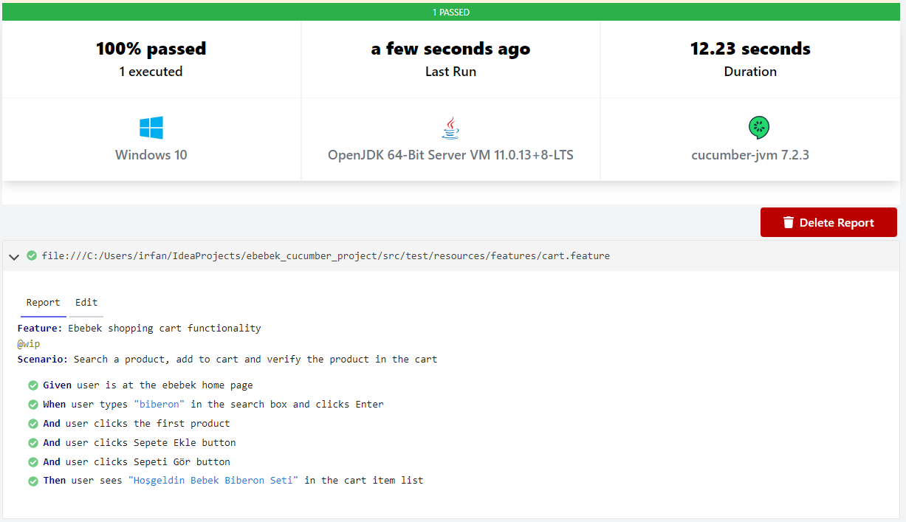

# TASK-1 : Manuel Test Senaryosu
Sepet sayfasındaki işlemler için işlevsel test senaryoları geliştiriniz.

Link: https://github.com/irfanalkan23/ebebek_cucumber_project/blob/master/Ebebek%20Manuel%20Test%20Senaryosu.docx

Link: https://github.com/irfanalkan23/ebebek_cucumber_project/blob/master/Ebebek%20Manuel%20Test%20Senaryosu.xlsx

# TASK-2 : Ebebek Test Otomasyonu (UI)

www.e-bebek.com alışveriş sepeti fonksiyonel testi Java-Cucumber-Selenium framework ile yapılmıştır.

## How to run the app?
CukesRunner sınıfında veya Maven -> Lifecycle -> Test ile çalıştırılabilir.

## About the framework
* Java OOP ve inheritance prensipleri uygulandı.
* Cucumber BDD ve Gherkin dili kullanıldı.
* Page Object Model (POM) uygulandı.
* Test case'ler cart.feature dosyasında Gherkin dili ile tanımlandı.
* Cucumber framework içerisinde ConfigurationReader, Driver, Hooks kullanıldı.
* Maven build tool kullanıldı, pom.xml'de plugin ve dependency'ler tanımlandı.

## Test Raporu

## Task Description
Aşağıdaki test senaryosunu Cucumber, Selenium ve istediğiniz programlama dili ile geliştiriniz.
1. Ana sayfa açılır. (www.e-bebek.com)
2. Arama çubuğuna "biberon" yazılır.
3. Arama yapılır.
4. İlk ürüne tıklanır.
5. "Sepete Ekle" butonuna tıklanır.
6. "Sepeti Gör” butonuna tıklanır.
7. Ürünün sepete eklendiği kontrol edilir.

# TASK-3 : Test Otomasyonu – API
API isteği sonucunun (HTTP Status Code) kontrolünü gerçekleştiren aşağıdaki test senaryosunu istediğiniz programlama dili ile geliştiriniz.

Senaryo: Seçilecek birer tane GET ve POST isteği için “HTTP Status Code” 200 (başarılı), değilse (başarısız) olan test senaryosu. (http://generator.swagger.io)

Task Solution Link : https://github.com/irfanalkan23/ebebek_cucumber_project/blob/master/src/test/java/com/ebebek/apiTest/API_Test.java
